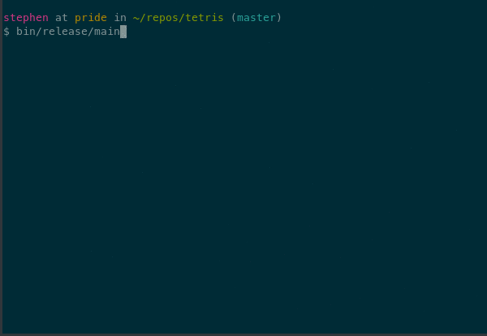

Tetris
======

A tetris game in C using NCURSES.  It's pretty feature complete, except for
stretch goals I may pick up in my free time.

Building
--------

My dependencies are:

* `libsdl` and `libsdl_mixer` 1.2 for sound.
* `ncurses` for terminal manipulation.

To install them on Arch Linux:

    sudo pacman -S sdl_mixer ncurses

To install them on Ubuntu:

    sudo apt-get install libsdl-mixer1.2-dev libncurses5-dev

To compile:

    make

To run:

    bin/release/main

You will need to provide a file named `tetris.mp3` in the same directory that
you're running the game from.  As I understand it, the official Tetris theme
song is legally protected in the use of games like this, so I will not be
providing or linking to that.  But I'm sure you could find something!  (**You do
not need to provide `tetris.mp3` in order to play the game, only if you want
sound!**).

Instructions
------------

The controls are typical of Tetris:
* <kbd>←</kbd> and <kbd>→</kbd>: Move the tetromino,
* <kbd>↑</kbd>: Rotate (clockwise?) the tetromino,
* <kbd>↓</kbd>: Immediately drop the tetromino (not a fast drop, an immediate drop),
* <kbd>Q</kbd>: Exit the game prematurely,
* <kbd>P</kbd>: Pause the game (any key to resume),
* <kbd>B</kbd>: "Boss mode" - show a mock terminal screen to fool nosy onlookers.  Hit
  <kbd>F1</kbd> to resume the game afterwards.
* <kbd>S</kbd>: Save game and exit (just assumes filename `tetris.save`).  To resume the
  game, run `bin/release/main tetris.save` (or whatever you may have renamed the
  game save to).

Future/Stretch Goals
--------------------

* Sound effects (in addition to the theme music).
* Networked multiplayer!
